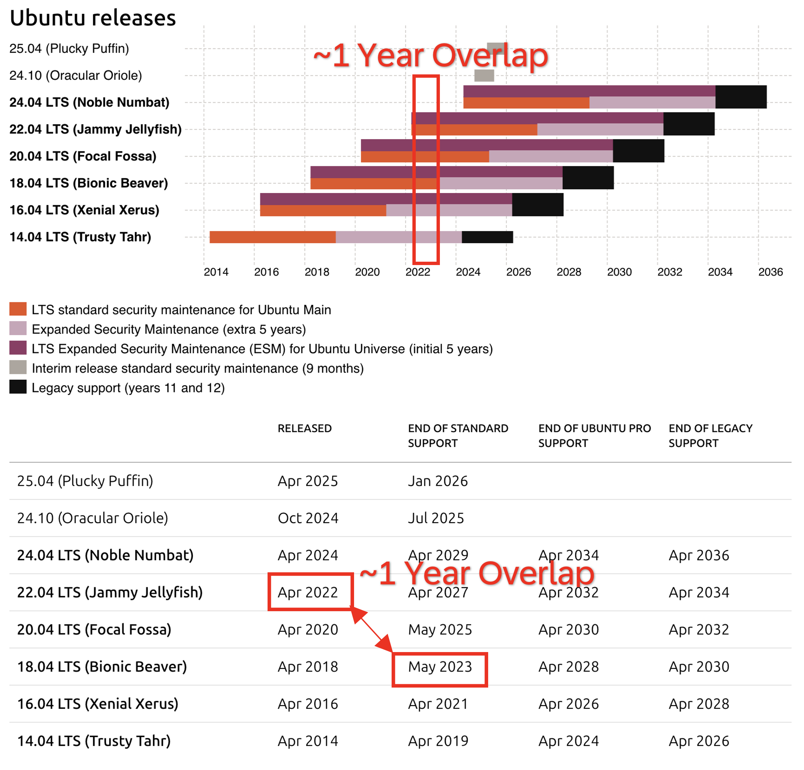

# Meta

- Name: Communicate intent to have a stack with every Ubuntu LTS release
- Start Date: 2025-07-15
- Author(s): @FloThinksPi
- Status: Draft
- RFC Pull Request: [community#TBD](https://github.com/cloudfoundry/community/pull/TBD)

## Summary

This RFC proposes that Cloud Foundry (CF) communicates a general intent to maintain a stack for every Ubuntu Long Term Support (LTS) release, rather than skipping LTS versions. This is not a commitment to provide a stack for every LTS release, but rather a statement of intent to be referenced in consequent RFCs that introduce new stacks. Additionally serving as communication towards foundation operators and users alike to set expectations that every 2 years some effort to adopt will most likely be required.

## Table of Contents

- [Meta](#meta)
- [Summary](#summary)
- [Problem](#problem)
- [Motivation](#motivation)
- [Proposal](#proposal)
  - [Positive Impact](#positive-impact)
  - [Negative Impact](#negative-impact)

## Problem

Currently, Cloud Foundry only provides a stack for every second Ubuntu LTS release. For example, CFLinuxFS3 was based on Ubuntu 18.04 LTS (Bionic Beaver), and CFLinuxFS4 is based on Ubuntu 22.04 LTS (Jammy Jellyfish), skipping Ubuntu 20.04 LTS (Focal Fossa). This results in a short migration window for users and buildpack providers, as the overlap between supported stacks is limited. In practice, users may have as little as a few weeks to migrate before the old stack is removed, creating significant operational challenges and risk.

With the introduction of CFLinuxFS5, which will be based on Ubuntu 24.04 LTS (Noble Numbat), the CF community aims to change this approach. However, the current stance of the community may be better communicated to foundation operators and users to set expectations. Also to create awareness that with each new stack release, users and buildpack providers and foundation operators will have some effort the one way or another.

## Motivation

- Extend the migration window for users and buildpack providers from a few weeks to approximately two years.
- Reduce risk and operational pressure during stack transitions.
- Align CF stack support with Ubuntu's LTS release and support cadence.
- Enable smoother adoption and deprecation of stacks.

## Proposal

Cloud Foundry should communicate an intent to provide and maintain a stack for every Ubuntu LTS release, starting with Ubuntu 24.04 LTS (Noble Numbat) and continuing with each subsequent LTS. Instead of skipping LTS versions, CF will build and release a new stack every two years, in line with Ubuntu's LTS schedule.

For example:

- CFLinuxFS3 was based on Ubuntu 18.04 LTS (Bionic Beaver)
- CFLinuxFS4 is based on Ubuntu 22.04 LTS (Jammy Jellyfish)
- CFLinuxFS5 will be based on Ubuntu 24.04 LTS (Noble Numbat)
- CFLinuxFS6 will be based on Ubuntu 26.04 LTS (TBD)

The overlap CFLinuxFS3 and CFLinuxFS4 had is one year. Which initially seems quite fine to adopt to -- but only for a user of Ubuntu. It also takes us time to consume a new ubuntu LTS and produce a Stack from it. And it also takes us time to adopt our buildpacks to the new stack.

It was 10th November 2022 when we had a first version of CFLinuxFS4 ready to test cloudfoundry/cf-deployment#1008

It was 20th April 2023 when we had adopted all necessary components like e.g buildpacks so that we could set CFLinuxFS4 as new default.
cloudfoundry/cf-deployment#1070

Just at that time it made really sense for a customer to test his app against new stack and buildpacks. CFLinuxFS3 was officially removed 17th of May 2023. cloudfoundry/cf-deployment#1078

Which essentially boiled down the 1 Year ubuntu LTS overlap to a tiny adoption window of 4 Weeks when not offering CFLinuxFS4 in an experimental state to CF Users of a Foundation or keeping CFLinuxFS3 in the system for longer with a custom Ops file in CF-Deployment.

Instead of using just every second Ubuntu LTS for a stack we could use every Ubuntu LTS and build a stack every 2 Years. The migration window should increase (using the same numbers as from the experience with CFLinuxFS4 and taking so long to release a stack) from 4 Weeks to roughly 2 Years.

Currently the CF Community already committed to a CFLinuxFS5 stack based on Ubuntu 24.04(Noble Numbat) with RFC-39.

This proposal is to communicate the intent to continue this approach for future LTS releases, starting with Ubuntu 26.04 LTS (TBD). Cloud Foundry should document this and thereby set expectations for the users and foundation operators as well as buildpack providers that every two years, a new stack will be released based on the latest Ubuntu LTS. It may create some effort on their end every two years. However this RFC is just to document the intent and not to commit to a specific stack release schedule.

## Positive Impact

- Users and buildpack providers have ~2 years to migrate to new stacks before the old stack is removed if the cf foundation acts on the intent to provide a stack for every LTS.
- Expectations are set for users and foundation operators that every two years, a new stack will be released based on the latest Ubuntu LTS.

## Negative Impact

- Increases maintenance effort and cost, as two stacks will need to be supported in parallel for each four-year period. But in case this is a problem, Cloud Foundry could diverge from the documented intent and skip a stack release.
